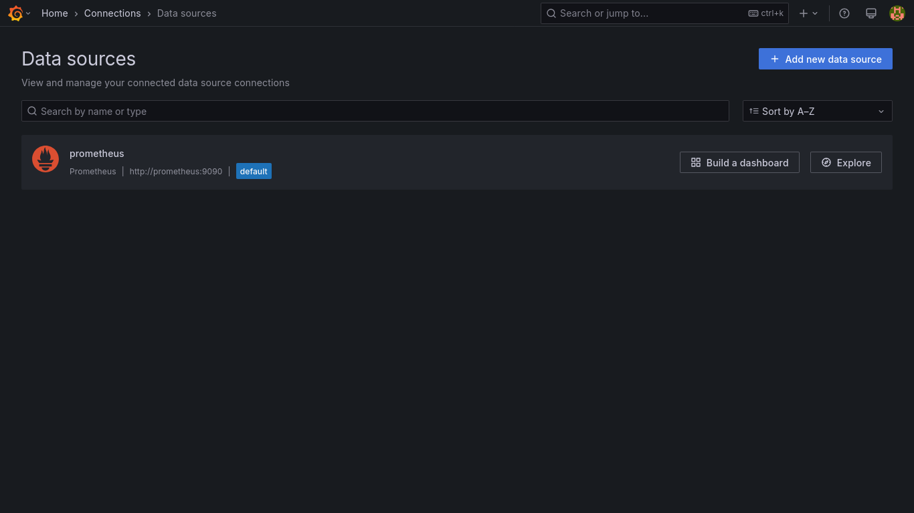

# Instructions for Creating the Setup

## 0. Docker Compose File
Create a `docker-compose.yml` file that does the following:

### 0.1) Start 3 Containers for Prometheus Demo Service
- Use the image `docker.io/julius/prometheus-demo-service:latest`.
- Configure three containers:
  - **Container 1**: Listen on port `10000`, route to destination port `8080`.
  - **Container 2**: Listen on port `20000`, route to destination port `8080`.
  - **Container 3**: Listen on port `30000`, route to destination port `8080`.
- Set the service names to `prometheus-service-demo-N` where `N` is the identifier (`0`, `1`, or `2`).

### 0.2) Start a Prometheus Container
- Use the Prometheus image.
- Map port `9090` on the host to port `9090` in the container.
- Mount the file `prometheus.yml` from the host into `/etc/prometheus/prometheus.yml` in the container.

### 0.3) Start a Grafana Container
- Use the Grafana image.
- Map port `3000` on the host to port `3000` in the container.
- Make Grafana depend on the Prometheus container.
- Create a volume named `grafana-storage` and mount it into `/var/lib/grafana` in the container.

### 0.4) Start a Node Exporter Container
- Use the Node Exporter image.
- Map port `9100` on the host to port `9100` in the container.

### Solution

```podman-compose.yml```

```yml
version: '3.8'

services:
  prometheus-service-demo-0:
    image: docker.io/julius/prometheus-demo-service:latest
    container_name: prometheus-service-demo-0
    ports:
      - "10000:8080"

  prometheus-service-demo-1:
    image: docker.io/julius/prometheus-demo-service:latest
    container_name: prometheus-service-demo-1
    ports:
      - "20000:8080"

  prometheus-service-demo-2:
    image: docker.io/julius/prometheus-demo-service:latest
    container_name: prometheus-service-demo-2
    ports:
      - "30000:8080"

  prometheus:
    image: docker.io/prom/prometheus:latest
    container_name: prometheus
    ports:
      - "9090:9090"
    volumes:
      - ./prometheus.yml:/etc/prometheus/prometheus.yml

  grafana:
    image: docker.io/grafana/grafana:latest
    container_name: grafana
    depends_on:
      - prometheus
    ports:
      - "3000:3000"
    volumes:
      - grafana-storage:/var/lib/grafana

  node-exporter:
    image: docker.io/prom/node-exporter:latest
    container_name: node-exporter
    ports:
      - "9100:9100"

volumes:
  grafana-storage:
```

```prometheus.yml```

```yml
global:
  scrape_interval: 15s

scrape_configs:
  - job_name: 'prometheus-service-demo'
    static_configs:
      - targets:
        - 'prometheus-service-demo-0:8080'
        - 'prometheus-service-demo-1:8080'
        - 'prometheus-service-demo-2:8080'

  - job_name: 'prometheus'
    static_configs:
      - targets:
        - 'localhost:9090'

  - job_name: 'node-exporter'
    static_configs:
      - targets:
        - 'node-exporter:9100'
```

### Check

```console
user@debian:~/Documents/pss/prometheus/final_lab$ podman ps -a
CONTAINER ID  IMAGE                                            COMMAND               CREATED      STATUS          PORTS                    NAMES
f5bd095907ff  docker.io/julius/prometheus-demo-service:latest                        3 hours ago  Up 3 hours ago  0.0.0.0:10000->8080/tcp  prometheus-service-demo-0
5b06b7c689bf  docker.io/julius/prometheus-demo-service:latest                        3 hours ago  Up 3 hours ago  0.0.0.0:20000->8080/tcp  prometheus-service-demo-1
ef29982e4667  docker.io/julius/prometheus-demo-service:latest                        3 hours ago  Up 3 hours ago  0.0.0.0:30000->8080/tcp  prometheus-service-demo-2
506ff9441691  docker.io/prom/prometheus:latest                 --config.file=/et...  3 hours ago  Up 3 hours ago  0.0.0.0:9090->9090/tcp   prometheus
c8ecaf8a28eb  docker.io/prom/node-exporter:latest                                    3 hours ago  Up 3 hours ago  0.0.0.0:9100->9100/tcp   node-exporter
3ae1a3118729  docker.io/grafana/grafana:latest                                       3 hours ago  Up 3 hours ago  0.0.0.0:3000->3000/tcp   grafana
```


## 1. PromQL Queries

### 1.1) 90th Percentile of HTTP Request Duration

Calculate the time for 90% of HTTP requests for the API application grouped by path, HTTP method, and response status during the last 5 minutes:

### Solution

```promql
histogram_quantile(
    0.90, 
    sum(rate(demo_api_request_duration_seconds_bucket[5m])) 
    without (path, method, status)
)
```

### 1.2) 95th Percentile for API HTTP Requests

Query the 95% duration of API HTTP requests for the entire application grouped by path and HTTP method during the last 5 minutes:

### Solution

```promql
histogram_quantile(
    0.95, 
    sum(rate(demo_api_request_duration_seconds_bucket[5m])) 
    without (path, method)
)
```

### 1.3) Average HTTP Request Duration

Determine the average duration of HTTP requests over the last 5 minutes, grouped by path and HTTP method:

### Solution

```promql
sum(rate(demo_api_request_duration_seconds_sum[5m])) 
without (path, method) 
/
sum(rate(demo_api_request_duration_seconds_count[5m])) 
without (path, method)
```

### 1.4) Create a Dashboard in Grafana
Design and configure a dashboard in Grafana using the above PromQL queries.

### Solution

```dashboards/api_request_dashboard.json```

```json
{
  "annotations": {
    "list": [
      {
        "builtIn": 1,
        "datasource": {
          "type": "grafana",
          "uid": "-- Grafana --"
        },
        "enable": true,
        "hide": true,
        "iconColor": "rgba(0, 211, 255, 1)",
        "name": "Annotations & Alerts",
        "type": "dashboard"
      }
    ]
  },
  "description": "90th Percentile HTTP Request Duration (Grouped by Path, Method, and Status)\n95th Percentile API HTTP Request Duration (Grouped by Path and Method)\nAverage HTTP Request Duration (Grouped by Path and Method)",
  "editable": true,
  "fiscalYearStartMonth": 0,
  "graphTooltip": 0,
  "id": 1,
  "links": [],
  "panels": [
    {
      "collapsed": false,
      "gridPos": {
        "h": 1,
        "w": 24,
        "x": 0,
        "y": 0
      },
      "id": 6,
      "panels": [],
      "title": "Average",
      "type": "row"
    },
    {
      "datasource": {
        "type": "prometheus",
        "uid": "deiav9yt5zuv4c"
      },
      "description": "This panel shows the average HTTP request duration for all API paths and methods over the last 5 minutes.",
      "fieldConfig": {
        "defaults": {
          "color": {
            "mode": "palette-classic"
          },
          "custom": {
            "axisBorderShow": false,
            "axisCenteredZero": false,
            "axisColorMode": "text",
            "axisLabel": "",
            "axisPlacement": "auto",
            "barAlignment": 0,
            "barWidthFactor": 0.6,
            "drawStyle": "line",
            "fillOpacity": 0,
            "gradientMode": "none",
            "hideFrom": {
              "legend": false,
              "tooltip": false,
              "viz": false
            },
            "insertNulls": false,
            "lineInterpolation": "linear",
            "lineStyle": {
              "fill": "solid"
            },
            "lineWidth": 1,
            "pointSize": 5,
            "scaleDistribution": {
              "type": "linear"
            },
            "showPoints": "auto",
            "spanNulls": false,
            "stacking": {
              "group": "A",
              "mode": "none"
            },
            "thresholdsStyle": {
              "mode": "dashed"
            }
          },
          "decimals": 2,
          "fieldMinMax": false,
          "mappings": [],
          "max": 0.1,
          "min": 0,
          "thresholds": {
            "mode": "absolute",
            "steps": [
              {
                "color": "#73BF69"
              },
              {
                "color": "#EAB839",
                "value": 0.02
              },
              {
                "color": "dark-red",
                "value": 0.05
              },
              {
                "color": "#ffffff",
                "value": 0.07
              }
            ]
          },
          "unit": "ms"
        },
        "overrides": []
      },
      "gridPos": {
        "h": 8,
        "w": 12,
        "x": 0,
        "y": 1
      },
      "id": 4,
      "options": {
        "legend": {
          "calcs": [],
          "displayMode": "list",
          "placement": "bottom",
          "showLegend": true
        },
        "tooltip": {
          "hideZeros": false,
          "mode": "single",
          "sort": "none"
        }
      },
      "pluginVersion": "11.6.0",
      "targets": [
        {
          "editorMode": "code",
          "expr": "sum(rate(demo_api_request_duration_seconds_sum[5m]))\nwithout (path, method)\n/\nsum(rate(demo_api_request_duration_seconds_count[5m]))\nwithout (path, method)\n",
          "legendFormat": "__auto",
          "range": true,
          "refId": "A"
        }
      ],
      "title": "Average HTTP Request Duration (5m)",
      "type": "timeseries"
    },
    {
      "collapsed": false,
      "gridPos": {
        "h": 1,
        "w": 24,
        "x": 0,
        "y": 9
      },
      "id": 5,
      "panels": [],
      "title": "Percentiles",
      "type": "row"
    },
    {
      "datasource": {
        "type": "prometheus",
        "uid": "deiav9yt5zuv4c"
      },
      "description": "Displays the 90th percentile of API request durations over the last 5 minutes.",
      "fieldConfig": {
        "defaults": {
          "color": {
            "mode": "thresholds"
          },
          "mappings": [],
          "noValue": "No data",
          "thresholds": {
            "mode": "absolute",
            "steps": [
              {
                "color": "green"
              },
              {
                "color": "#EAB839",
                "value": 0.05
              },
              {
                "color": "red",
                "value": 0.08
              }
            ]
          },
          "unit": "ms"
        },
        "overrides": []
      },
      "gridPos": {
        "h": 8,
        "w": 12,
        "x": 0,
        "y": 10
      },
      "id": 1,
      "options": {
        "colorMode": "value",
        "graphMode": "area",
        "justifyMode": "auto",
        "orientation": "auto",
        "percentChangeColorMode": "standard",
        "reduceOptions": {
          "calcs": [
            "lastNotNull"
          ],
          "fields": "",
          "values": false
        },
        "showPercentChange": false,
        "textMode": "auto",
        "wideLayout": true
      },
      "pluginVersion": "11.6.0",
      "targets": [
        {
          "datasource": {
            "type": "prometheus",
            "uid": "deiav9yt5zuv4c"
          },
          "editorMode": "code",
          "expr": "histogram_quantile(\n    0.90,\n    sum(rate(demo_api_request_duration_seconds_bucket[5m]))\n    without (path, method, status)\n)",
          "hide": false,
          "instant": false,
          "legendFormat": "__auto",
          "range": true,
          "refId": "A"
        }
      ],
      "title": "90th Percentile API Request Duration",
      "type": "stat"
    },
    {
      "datasource": {
        "type": "prometheus",
        "uid": "deiav9yt5zuv4c"
      },
      "description": "Shows the duration for 95% of requests over the last 5 minutes.",
      "fieldConfig": {
        "defaults": {
          "color": {
            "mode": "thresholds"
          },
          "mappings": [],
          "max": 0.1,
          "thresholds": {
            "mode": "absolute",
            "steps": [
              {
                "color": "green"
              },
              {
                "color": "#EAB839",
                "value": 0.04
              },
              {
                "color": "red",
                "value": 0.06
              }
            ]
          },
          "unit": "ms"
        },
        "overrides": []
      },
      "gridPos": {
        "h": 8,
        "w": 12,
        "x": 12,
        "y": 10
      },
      "id": 3,
      "options": {
        "displayMode": "gradient",
        "legend": {
          "calcs": [],
          "displayMode": "list",
          "placement": "bottom",
          "showLegend": false
        },
        "maxVizHeight": 300,
        "minVizHeight": 16,
        "minVizWidth": 8,
        "namePlacement": "auto",
        "orientation": "auto",
        "reduceOptions": {
          "calcs": [
            "lastNotNull"
          ],
          "fields": "",
          "values": false
        },
        "showUnfilled": true,
        "sizing": "auto",
        "valueMode": "color"
      },
      "pluginVersion": "11.6.0",
      "targets": [
        {
          "editorMode": "code",
          "expr": "histogram_quantile(\n    0.95,\n    sum(rate(demo_api_request_duration_seconds_bucket[5m]))\n    without (path, method)\n)\n",
          "legendFormat": "__auto",
          "range": true,
          "refId": "A"
        }
      ],
      "title": "95th Percentile API Request Duration",
      "type": "bargauge"
    }
  ],
  "preload": false,
  "schemaVersion": 41,
  "tags": [],
  "templating": {
    "list": []
  },
  "time": {
    "from": "now-1h",
    "to": "now"
  },
  "timepicker": {},
  "timezone": "browser",
  "title": "PromQL",
  "uid": "aeiawe742kvswf",
  "version": 8
}
```

### Data Source



### Dashboard Overview


### 90th Percentile Panel


### 95th Percentile Panel


### Average HTTP Panel


## 2. Dashboard for Computational Resources

### Create a dedicated row for **Computational Resources**.

### 2.1) Stat Panel: Number of CPUs

- **Metric**: PromQL to count the number of CPUs:

### Solution

```promql
count(node_cpu_seconds_total{mode="system"})
```

- **Panel Type**: Stat Panel.

### Solution


### Check

```console
user@debian:~/Documents/pss/prometheus/final_lab$ nproc 
4
```

### 2.2) Gauge Panel: Root Filesystem Usage

- **Metric**: PromQL to calculate the percentage of root filesystem (`/`) usage:

### Solution

```promql
100 - ((node_filesystem_avail_bytes{mountpoint="/"} / node_filesystem_size_bytes{mountpoint="/"}) * 100)
```

- **Panel Type**: Gauge Panel.
- **Thresholds**:
  - `80%`: **Orange**.
  - `90%`: **Red**.

### Solution


### Check

```console
user@debian:~/Documents/pss/prometheus/final_lab$ df -h
Filesystem      Size  Used Avail Use% Mounted on
udev            5.8G     0  5.8G   0% /dev
tmpfs           1.2G  1.4M  1.2G   1% /run
/dev/sda1       109G   83G   21G  81% /
tmpfs           5.9G   12M  5.8G   1% /dev/shm
tmpfs           5.0M   12K  5.0M   1% /run/lock
tmpfs           1.2G  500K  1.2G   1% /run/user/1000
user@debian:~/Documents/pss/prometheus/final_lab$ df -h | grep sda1
/dev/sda1       109G   83G   21G  81% /
```

### Dashboard Overview


```dashboards/computational_resources_dashboard.json```

```json
{
  "annotations": {
    "list": [
      {
        "builtIn": 1,
        "datasource": {
          "type": "grafana",
          "uid": "-- Grafana --"
        },
        "enable": true,
        "hide": true,
        "iconColor": "rgba(0, 211, 255, 1)",
        "name": "Annotations & Alerts",
        "type": "dashboard"
      }
    ]
  },
  "editable": true,
  "fiscalYearStartMonth": 0,
  "graphTooltip": 0,
  "id": 2,
  "links": [],
  "panels": [
    {
      "collapsed": false,
      "gridPos": {
        "h": 1,
        "w": 24,
        "x": 0,
        "y": 0
      },
      "id": 1,
      "panels": [],
      "title": "Computational Resources",
      "type": "row"
    },
    {
      "datasource": {
        "type": "prometheus",
        "uid": "deiav9yt5zuv4c"
      },
      "fieldConfig": {
        "defaults": {
          "color": {
            "mode": "thresholds"
          },
          "mappings": [],
          "thresholds": {
            "mode": "absolute",
            "steps": [
              {
                "color": "green"
              },
              {
                "color": "red",
                "value": 80
              }
            ]
          },
          "unit": "short"
        },
        "overrides": []
      },
      "gridPos": {
        "h": 8,
        "w": 12,
        "x": 0,
        "y": 1
      },
      "id": 2,
      "options": {
        "colorMode": "value",
        "graphMode": "area",
        "justifyMode": "auto",
        "orientation": "auto",
        "percentChangeColorMode": "standard",
        "reduceOptions": {
          "calcs": [
            "lastNotNull"
          ],
          "fields": "",
          "values": false
        },
        "showPercentChange": false,
        "textMode": "auto",
        "wideLayout": true
      },
      "pluginVersion": "11.6.0",
      "targets": [
        {
          "editorMode": "code",
          "expr": "count(node_cpu_seconds_total{mode=\"system\"})",
          "legendFormat": "__auto",
          "range": true,
          "refId": "A"
        }
      ],
      "title": "Number of CPUs",
      "type": "stat"
    },
    {
      "datasource": {
        "type": "prometheus",
        "uid": "deiav9yt5zuv4c"
      },
      "fieldConfig": {
        "defaults": {
          "color": {
            "mode": "thresholds"
          },
          "mappings": [],
          "max": 100,
          "min": 0,
          "thresholds": {
            "mode": "percentage",
            "steps": [
              {
                "color": "green"
              },
              {
                "color": "#EAB839",
                "value": 80
              },
              {
                "color": "red",
                "value": 90
              }
            ]
          },
          "unit": "percent"
        },
        "overrides": []
      },
      "gridPos": {
        "h": 8,
        "w": 12,
        "x": 12,
        "y": 1
      },
      "id": 3,
      "options": {
        "minVizHeight": 75,
        "minVizWidth": 75,
        "orientation": "auto",
        "reduceOptions": {
          "calcs": [
            "lastNotNull"
          ],
          "fields": "",
          "values": false
        },
        "showThresholdLabels": false,
        "showThresholdMarkers": true,
        "sizing": "auto"
      },
      "pluginVersion": "11.6.0",
      "targets": [
        {
          "editorMode": "code",
          "expr": "100 - (\n  (node_filesystem_avail_bytes{mountpoint=\"/\"} \n  / \n  node_filesystem_size_bytes{mountpoint=\"/\"}) \n  * 100 \n)",
          "legendFormat": "__auto",
          "range": true,
          "refId": "A"
        }
      ],
      "title": "Root Filesystem Usage",
      "type": "gauge"
    }
  ],
  "preload": false,
  "schemaVersion": 41,
  "tags": [],
  "templating": {
    "list": []
  },
  "time": {
    "from": "now-1h",
    "to": "now"
  },
  "timepicker": {},
  "timezone": "browser",
  "title": "New dashboard",
  "uid": "ceib1ldj67w1sa",
  "version": 5
}
```
